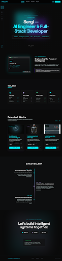

# 🚀 Sergi Regany | Premium Full-Stack AI Engineer Portfolio

Welcome to the official repository of my professional portfolio. This is a high-performance, responsive web application built with the latest technologies to showcase my intersection between **Software Architecture** and **Applied Artificial Intelligence**.



## 🧠 NexusAI Agent
One of the core features of this portfolio is the integrated **Personal AI Agent**. 
- **Universal Fetch System**: Built to bypass standard SDK limitations, ensuring 100% availability by rotating between Gemini 1.5 Flash, 1.5 Pro, and 1.0 Pro.
- **Smart Context**: Pre-trained with my professional career, technical stack, and project history to answer recruiter queries in real-time.
- **Natural Language**: Configured with a conversational yet professional personality.

## 🛠 Tech Stack
- **Framework**: [Next.js 16 (Turbopack)](https://nextjs.org/)
- **Core**: React 19 & TypeScript
- **Styling**: Tailwind CSS & Framer Motion (for premium glassmorphism animations)
- **AI Infrastructure**: Google Gemini API & Vercel AI SDK
- **Icons**: Lucide React

## ✨ Key Features
- **Responsive Architecture**: 100% fluid design for Mobile, Tablet, and Desktop.
- **Evolution Map**: A visual storytelling component of my career path from Mathematics to AI Engineering.
- **Adaptive UI**: Optimized for core web vitals and high-speed interaction.
- **Secure Integration**: Environment-based API management (No keys committed to repo).

## 🚀 Deployment

### Prerequisites
- Node.js 18+ 
- A [Google AI Studio](https://aistudio.google.com/) API Key.

### Installation
1. Clone the repo:
   ```bash
   git clone https://github.com/sregany/dev-Sergi.git
   ```
2. Install dependencies:
   ```bash
   npm install
   ```
3. Create a `.env.local` file:
   ```env
   GOOGLE_GENERATIVE_AI_API_KEY=your_api_key_here
   ```
4. Run locally:
   ```bash
   npm run dev
   ```

### Deploying to Vercel
1. Connect this repo to a new Project in Vercel.
2. Add `GOOGLE_GENERATIVE_AI_API_KEY` to the Environment Variables.
3. Deploy!

## 📩 Contact
- **Email**: [sergiregany1996@gmail.com](mailto:sergiregany1996@gmail.com)
- **LinkedIn**: [sregany](https://www.linkedin.com/in/sregany/)
- **GitHub**: [@sregany](https://github.com/sregany)

---
*Created with ❤️ by Sergi Regany.*
